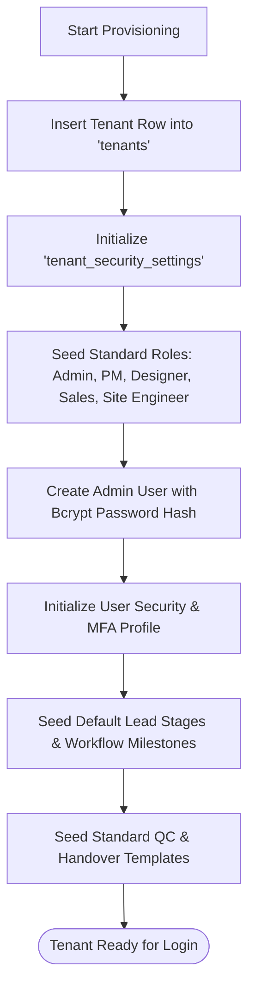

# Multi-Tenant Architecture, Enterprise Security & Platform Operations Guide

This document describes the multi-tenant architecture, database-level data isolation policies, workspace provisioning procedures, role-based access control, security controls, and the Platform Command Center within the CRM.

---

## 1. Multi-Tenant Architecture & Data Isolation

The application implements enterprise multi-tenancy using a **Shared Database + Shared Schema** model:

* **Database Partitioning**: Every client workspace (tenant) is represented as a unique row in the `tenants` table. All business and transactional tables enforce logical partitioning via `tenant_id UUID NOT NULL REFERENCES tenants(id) ON DELETE CASCADE`.
* **Tenant-Scoped Users**: The `users` table enforces a composite unique constraint `UNIQUE(tenant_id, email)`, enabling identical email addresses to exist independently across distinct tenant workspaces.
* **Tenant-Scoped Roles & Permissions**: Roles are bound to `tenant_id` and contain JSON-encoded action lists (e.g., `["leads:read", "projects:write"]`) or master bypass markers (`["*"]`).
* **Tenant Security Settings**: Tenant-specific security policies (session timeouts, MFA, IP allowlisting) are maintained per-tenant in `tenant_security_settings`.

### Application-Level Data Scoping
All SQL queries executed by services and repositories strictly bind `tenant_id = $tenantId` extracted from the authenticated user's JWT token session:
```javascript
const { rows } = await pool.query(
  'SELECT * FROM projects WHERE id = $1 AND tenant_id = $2',
  [projectId, req.tenantId]
);
```

---

## 2. Platform Command Center (SuperAdmin UI)

Component: [SuperAdminSettings.jsx](file:///d:/Digicloudify%20softwares/CRM-Interior-Construction/client/src/pages/config/SuperAdminSettings.jsx)  
Route: `/settings/superadmin`  
Access: Restricted strictly to Platform Developer / Superadmin (`isSuperMasterDeveloper(user)`).

### Core Capabilities
1. **Workspace Management**:
   * View all provisioned client tenants with status (`Active`, `Suspended`), subscription tier (`Starter`, `Growth`, `Enterprise`), admin email, created date, and active user counts.
   * Search and filter workspaces by name, slug, or tier.
   * Provision new workspaces directly via an intuitive modal form.
   * Edit workspace details, upgrade/downgrade subscription tiers, or suspend/reactivate client access.
2. **Sidebar Plan Configurator**:
   * Visual configuration matrix to customize which navigation tabs and modules are visible to users on each subscription package (`Starter`, `Growth`, `Enterprise`).
   * Real-time saving to database with instant synchronization across connected client sessions via WebSocket / storage events.
3. **Tenant Security Policies**:
   * Configure tenant-level Multi-Factor Authentication (MFA) enforcement (`mfa_required_all`).
   * Set maximum session idle timeout intervals (`session_timeout_minutes`).
   * Enforce concurrent active login limits.
   * Define geofence IP allowlists and allowed country codes.
4. **Global Health & Database Analytics**:
   * Real-time monitoring of total registered tenants, total active users, lead volume, project counts, database connections, and storage utilization.

---

## 3. CLI Tenant Provisioning Utility

For automated deployments and headless operations, a command-line provisioning script is available at [server/scripts/provisionTenant.js](file:///d:/Digicloudify%20softwares/CRM-Interior-Construction/server/scripts/provisionTenant.js).

### Syntax
```bash
node server/scripts/provisionTenant.js "<name>" "<slug>" "<adminEmail>" "<adminName>" "<adminPassword>"
```

### Parameters
1. `name`: Display name of the client company (e.g., `"Apex Interior Architects"`).
2. `slug`: URL-safe unique lowercase routing identifier (e.g., `"apex-interiors"`).
3. `adminEmail`: Initial workspace administrator email (e.g., `"admin@apex.com"`).
4. `adminName`: Full name of the initial administrator.
5. `adminPassword`: Initial password string (minimum 8 characters).

### Provisioning Sequence


---

## 4. Tenant Subscription Tiers & Default Tabs

The CRM organizes module accessibility into three subscription tiers:

| Plan Tier | Target Segment | Default Included Modules & Tabs |
| :--- | :--- | :--- |
| **Starter** | Independent Designers & Boutiques | Workspace Dashboard, Leads (List, Kanban, Calendar), Projects, My Tasks, Reports Hub, Team Members, Roles & Permissions, Organization. |
| **Growth** | Growing Interior Studios & Contractors | All Starter features + Lead Map, Lead Analytics, Project Analytics, Client Satisfaction (CSAT), Delay Analysis, Project Coordination, Handover Dashboard, Retention Dashboard, Team Capacity, Leave Management, Vendor Performance, Vendor Capacity. |
| **Enterprise** | Full-Service Turnkey & Commercial Firms | All Growth features + BOQ Variance, Team Workload, Lead Stages Setup, Custom Fields, Lead Forms Builder, Project Templates, Trade Activities, QC Checklists, Conversion Checklist, Workflow Automations, Vendor Lead Times, Finance Overview, Financial Approvals, Project Profitability, Payment Forecast, Financial Thresholds, Login History, Audit Trail, Platform Command Center, Developer API Keys & Webhooks Suite, Activity Logs. |

---

## 5. Security & Isolation Verification Procedures

To verify isolation boundaries across tenants:

1. **Positive Workspace Isolation (Tenant A → Data A)**:
   * Authenticate as `admin@client-a.com`.
   * Query `GET /api/leads` and verify that all returned records belong strictly to Client A.
2. **Cross-Tenant IDOR Prevention (Tenant A → Data B)**:
   * Authenticate as `admin@client-a.com`.
   * Attempt to query or patch a project belonging to Client B using its UUID (`GET /api/projects/:clientB_projectId`).
   * The backend must reject the request with `404 Not Found` or `403 Forbidden`.
3. **Search & Global Query Scoping**:
   * Execute global searches (`GET /api/search?q=...`) to ensure results never leak contacts, leads, or files across tenant partitions.
