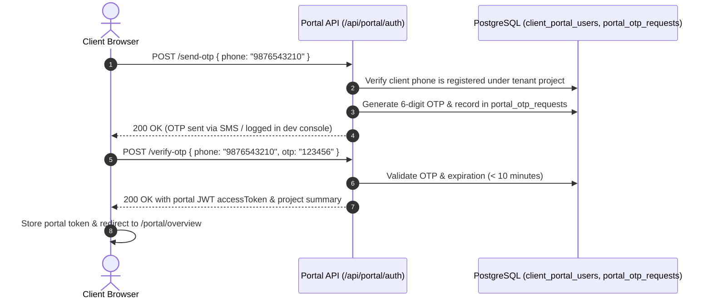

# Client Collaboration Portal Documentation

This document describes the architectural layout, authentication mechanism, client workflows, and API interfaces for the **Client Collaboration Portal** of the CRM.

---

## 1. Overview & Business Concept

The **Client Collaboration Portal** is a dedicated, white-labeled client-facing web application designed to give homeowners and commercial clients transparent, real-time visibility into their interior design and construction projects.

### Security Isolation: Dual-Token Architecture
Clients log in using a lightweight, passwordless **Phone Number + OTP** authentication mechanism. 
* Tokens generated for portal users are strictly scoped (`type: 'portal'`).
* The internal administration middleware rejects portal tokens if an external client attempts to access internal staff endpoints (such as `/api/users` or `/api/leads`).
* All portal API routes are mounted under `/api/portal/*` and strictly scope data to the client's associated `project_id` and `tenant_id`.

---

## 2. Portal User Authentication Flow

Component: [PortalLogin.jsx](file:///d:/Digicloudify%20softwares/CRM-Interior-Construction/client/src/portal/pages/PortalLogin.jsx)  
Route: `/portal/login`

### Step-by-Step Login Sequence

---

## 3. Client Portal Modules & Views

Component: [PortalApp.jsx](file:///d:/Digicloudify%20softwares/CRM-Interior-Construction/client/src/portal/PortalApp.jsx)  
Shell: [PortalShell.jsx](file:///d:/Digicloudify%20softwares/CRM-Interior-Construction/client/src/portal/components/PortalShell.jsx)

### 1. Project Overview (`/portal/overview`)
* High-level project summary: Current execution phase, overall percentage completion, target handover date, and assigned Project Manager & Designer contact cards.

### 2. Live Timeline (`/portal/timeline`)
* Visual milestone progression showing completed phases, ongoing tasks, and upcoming milestones with planned completion dates.

### 3. Approvals Hub (`/portal/approvals`)
* Centralized queue where client can review and provide digital sign-offs for pending design renders, material selections, and variations.

### 4. Design Concepts & 3D Renders (`/portal/design-concepts`)
* High-resolution gallery of 3D photorealistic renderings, 2D floor plans, and moodboards categorized by room (Living Room, Kitchen, Master Bedroom, etc.).

### 5. Design Reviews & Feedback (`/portal/design-reviews`)
* Interactive review canvas where clients can submit room-specific feedback, mark revisions, and give final design freeze approvals.

### 6. Material Palettes & Selections (`/portal/material-palettes` & `/portal/material-approvals`)
* Digital material finish board displaying laminate samples, tile patterns, wood veneer stains, and paint swatches with approval toggles.

### 7. Change Orders (`/portal/change-orders`)
* Review requested scope changes and variations with detailed line-item cost and timeline adjustments. Clients can digitally accept or decline variations.

### 8. Documents Repository (`/portal/documents`)
* Downloadable vault of executed agreements, approved drawings, municipal permits, and product warranty manuals.

### 9. Meeting Minutes (`/portal/meeting-notes`)
* Review summaries of past client-contractor coordination meetings and agreed action items.

### 10. Snag Reporting & Punch List (`/portal/snags` & `/portal/punch-list`)
* Enables clients to photograph and report snags, cosmetic defects, or alignment issues during pre-handover inspections and track their rectification status.

### 11. Property Handover (`/portal/handover`)
* Pre-handover readiness checklist, formal handover kit receipt, key acknowledgment, and digital final sign-off.

### 12. Payments & Tax Invoices (`/portal/payments`)
* Financial summary: Contract Value, Total Paid, and Outstanding. Download official GST tax invoices and payment receipts.

### 13. Warranties, AMCs & Claims (`/portal/warranties`, `/portal/amcs`, `/portal/claims`)
* Post-possession warranty certificates, annual maintenance contract visit schedules, and warranty claim ticket filing.

### 14. Service Tickets (`/portal/service-tickets`)
* Post-handover customer support ticket submission with photo uploads, category tagging, and live resolution status.

### 15. Weekly Reports & Site Visits (`/portal/weekly-reports` & `/portal/site-visits`)
* Weekly site progress photo galleries and inspection summaries logged by the project management team.

---

## 4. API Endpoints

All portal routes are defined under `/api/portal/*`:

* `/api/portal/auth`: Phone OTP generation and token verification.
* `/api/portal/project`: Current project details, milestone progression, and stats.
* `/api/portal/branding`: Dynamic tenant branding (logo, brand colors, company name).
* `/api/portal/design-assets`: Design concepts and 3D rendering gallery.
* `/api/portal/design-reviews`: Design review rounds, feedback submission, approvals.
* `/api/portal/material-palettes`: Material sample boards and finish approvals.
* `/api/portal/change-orders`: Scope variations review and client sign-off.
* `/api/portal/snags` & `/api/portal/punch-lists`: Defect reporting and verification.
* `/api/portal/handover`: Handover readiness checklist and possession sign-off.
* `/api/portal/warranties`, `/api/portal/amcs`, `/api/portal/warranty-claims`: Warranty certificates, AMC visits, and claim submissions.
* `/api/portal/service-tickets`: Service ticket submission and SLA tracking.
* `/api/portal/quotations`: Approved BOQ quotations and estimates.
