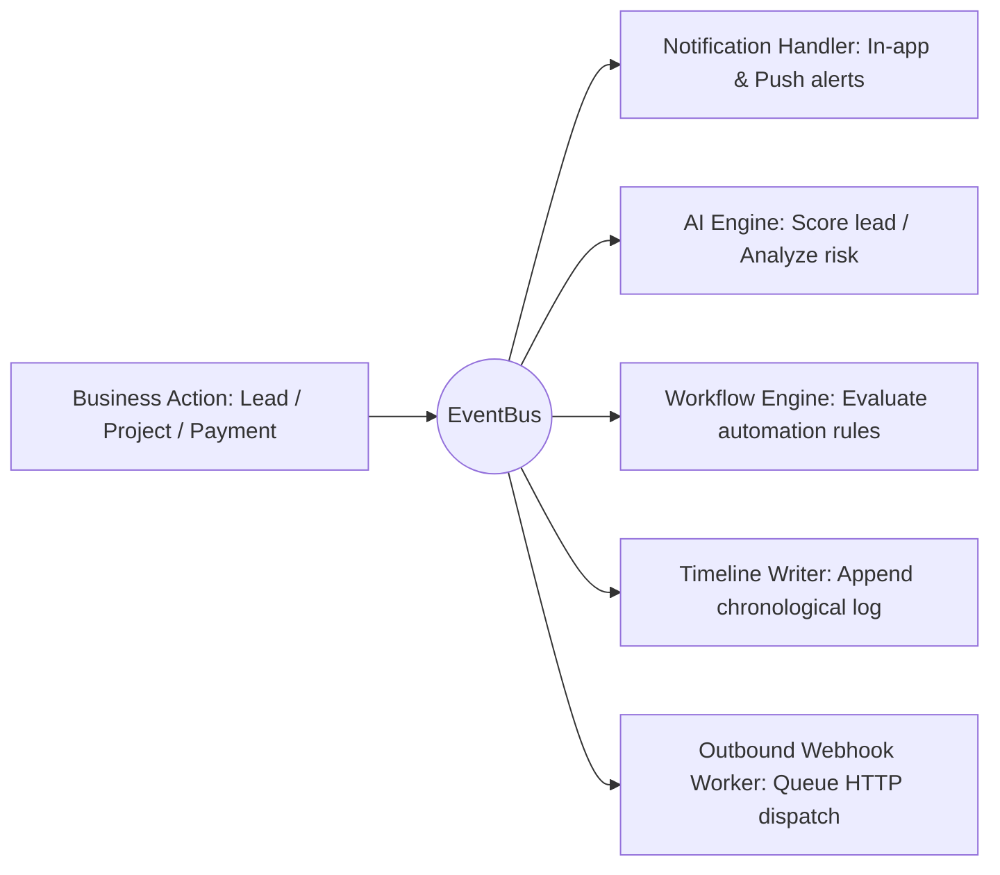
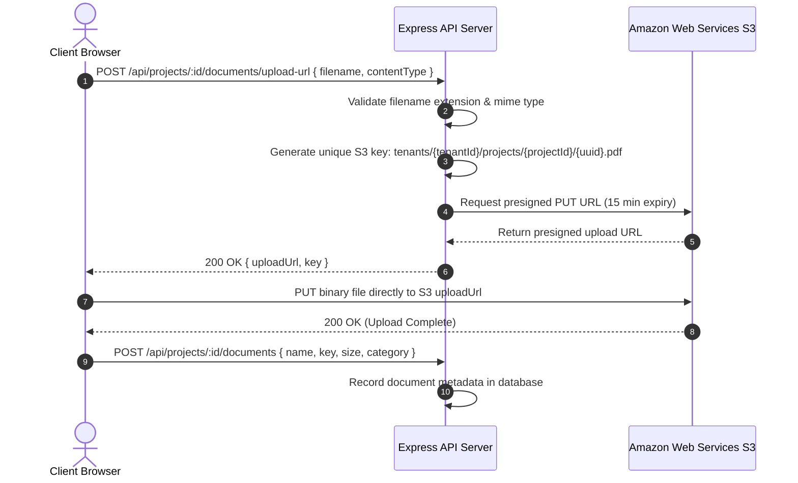

# Developer Tools, API & Integration Suite Documentation

This document describes the external API architecture, developer tools, webhook engine, third-party integrations, and event-driven services of the CRM platform.

---

## 1. Overview & Integration Architecture

The CRM provides enterprise connectivity to external marketing platforms, third-party ERPs, payment gateways, and custom applications through:
* **Versioned REST API** (`/api/v1`) authenticated via scoped API Keys.
* **Developer Command Center** with an interactive API Sandbox / Playground and live latency logs.
* **Inbound Webhook Hub**: Automated ingestion of lead payloads from Meta/Facebook Ads, Google Ads, IndiaMART, Justdial, and Zapier.
* **Outbound Webhooks**: Event-driven webhook dispatch with cryptographic HMAC-SHA256 signature verification.
* **Internal EventBus**: Asynchronous event dispatching to background worker handlers.
* **Direct AWS S3 Media Pipeline**: Presigned URL direct browser uploads.
* **Google Gemini AI Engine**: Automated sentiment analysis, risk prediction, and audio transcription.

---

## 2. API Keys & Versioned REST API

### 2.1 API Key Security Model
API Keys are generated within the Developer Console ([ApiIntegrationPage.jsx](file:///d:/Digicloudify%20softwares/CRM-Interior-Construction/client/src/pages/developer/ApiIntegrationPage.jsx)).
* Keys are prefixed with a recognizable identifier (e.g., `crm_live_...`).
* The raw secret is shown **only once** upon generation and hashed before storage in the `api_keys` table.
* Each key can be assigned specific permission scopes (e.g., `Leads Read`, `Leads Write`, `Projects Read`, `Financials Read`, `Webhooks Manage`).
* Keys support optional expiration dates and immediate one-click revocation.

### 2.2 Making Requests
API Keys are supplied in the `X-API-Key` or `Authorization: Bearer <KEY>` header:
```bash
curl -X GET https://your-crm-domain.com/api/v1/leads \
  -H "X-API-Key: crm_live_xxxxxxxxxxxxxxxxxxxxxxxx" \
  -H "Accept: application/json"
```

### 2.3 Interactive Developer Console
The UI provides an interactive API Playground (`FiTerminal`) allowing developers to test API endpoints directly within the browser, inspect HTTP headers, tweak parameters, and view colorized JSON responses and curl command snippets.

### 2.4 Live API Logs & Telemetry
Tracks request method, route, HTTP status code, client IP, and response latency (in milliseconds), with export capabilities to CSV, Excel, and PDF.

---

## 3. Inbound Webhooks (Lead Ingestion)

Route: `/api/webhooks/inbound/:provider`  
Manager: [WebhooksManager.jsx](file:///d:/Digicloudify%20softwares/CRM-Interior-Construction/client/src/pages/config/WebhooksManager.jsx)

The Inbound Webhook Hub ingests prospective client inquiries directly into the CRM sales pipeline from external ad networks:

| Inbound Provider | Ingestion URL Path | Supported Features |
| :--- | :--- | :--- |
| **Meta / Facebook Ads** | `/api/webhooks/inbound/facebook` | Lead ad form verification challenge (`hub.challenge`), automatic parsing of client name, phone, email, project type, and campaign metadata. |
| **Google Ads** | `/api/webhooks/inbound/google` | Google Lead Form Extension webhook payload mapping. |
| **IndiaMART** | `/api/webhooks/inbound/indiamart` | Native JSON/XML lead format parser with phone deduplication. |
| **Justdial** | `/api/webhooks/inbound/justdial` | Automatic mapping of location, budget, and trade requirements. |
| **Zapier / Custom** | `/api/webhooks/inbound/custom` | Flexible field mapping engine to match custom JSON keys to CRM lead fields. |

### Inbound Webhook Testing & Diagnostics
The Webhooks Manager UI includes an **Inbound Webhook Tester Modal** allowing developers to simulate incoming webhooks, test schema mapping rules, and view parsing outputs before going live.

---

## 4. Outbound Webhooks (Event Dispatching)

Route: `/api/webhooks`  
Implementation: [webhooks.js](file:///d:/Digicloudify%20softwares/CRM-Interior-Construction/server/src/routes/webhooks.js)

### Supported Trigger Events
* `lead.created`, `lead.stage_changed`, `lead.converted`
* `project.created`, `project.status_changed`, `project.phase_completed`
* `payment.recorded`, `invoice.sent`, `approval.approved`, `approval.rejected`
* `snag.created`, `snag.resolved`, `handover.completed`

### Security Verification (HMAC-SHA256)
Every outbound webhook payload is signed with the tenant's webhook signing secret. The signature is transmitted in the `X-CRM-Signature` header:
```javascript
const signature = crypto
  .createHmac('sha256', secret)
  .update(JSON.stringify(payload))
  .digest('hex');
```

---

## 5. Internal EventBus Architecture

The server utilizes an asynchronous in-memory EventBus to decouple business operations from secondary side effects:



* **`notificationEventHandler`**: Dispatches in-app notification records and browser push alerts.
* **`aiEventHandler`**: Invokes Google Gemini API asynchronously to calculate sentiment and project health scores without blocking the main API thread.
* **`workflowEngine`**: Evaluates custom trigger-action automation rules configured in [AutomationBuilder.jsx](file:///d:/Digicloudify%20softwares/CRM-Interior-Construction/client/src/pages/config/AutomationBuilder.jsx).
* **`timelineWriter`**: Inserts audit timeline events into `lead_timeline` and project activity logs.

---

## 6. AWS S3 Direct Upload Pipeline

The application eliminates server-side file bottlenecking by utilizing **AWS S3 Presigned URLs**:



* Prevents server memory exhaustion and bypasses reverse-proxy request payload limits.
* Preserves media original quality without local file storage risks.
* Secure fallback endpoint (`/api/local-download`) with strict directory traversal prevention for local non-AWS development environments.

---

## 7. Google Gemini AI Engine

Module: [server/src/services/ai/](file:///d:/Digicloudify%20softwares/CRM-Interior-Construction/server/src/services/ai/)

Integrated via `@google/genai`:
* **Lead Sentiment & Scoring**: Analyzes initial lead notes and conversation history to score conversion likelihood (`0-100`) and suggest key talking points.
* **Project Risk Assessment**: Evaluates schedule variance, pending change orders, and unpaid milestones to highlight project delivery risks.
* **Audio Transcription & Meeting Minutes**: Transcribes recorded site visit voice memos and automatically formats structured Minutes of Meeting (MOM).
