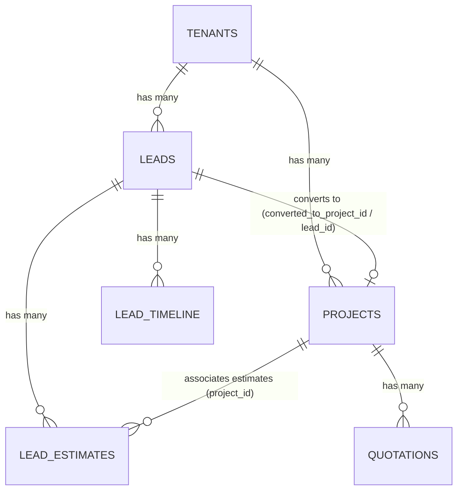
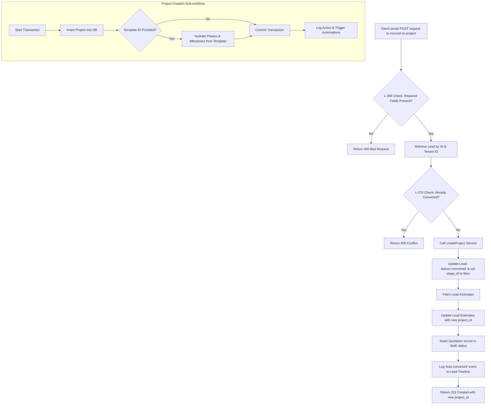

# Lead & Project Relationship and Conversion Workflow

This document explains the conceptual model, database schema references, and the execution workflow for how a **Lead** is related to a **Project** and converted in the CRM system.

---

## 1. Overview & Business Concept

A **Lead** represents a prospective client at the top of the sales funnel. As the lead is nurtured, it goes through several pipeline stages (e.g., *Contacted*, *Proposal Sent*, *Negotiation*). 

Once a lead is won, it transitions from the sales pipeline into execution. This transition is represented by the **Lead-to-Project Conversion**, which is a **one-way, irreversible process**. 

During conversion:
- A new project record is created in the database.
- The lead status is marked as `'converted'`.
- All linked estimates and assets are synchronized or migrated.
- The project becomes the active entity for scheduling phases, milestones, tasks, and payment tracking.

---

## 2. Database Relationship Model

Leads and Projects share a strict **1-to-1 relationship** defined by dual foreign keys for fast lookup from both sides:

- **`leads.converted_to_project_id`**: Links a lead to its corresponding project.
- **`projects.lead_id`**: Links a project back to the originating lead.

### Entity Relationship Diagram



### Table Schemas & Foreign Keys

#### `leads` Table Schema Fragment
Defined in [005_leads.sql](file:///d:/Digicloudify%20softwares/CRM-Interior-Construction/server/migrations/005_leads.sql):
* `id` (UUID, Primary Key)
* `tenant_id` (UUID, Foreign Key to `tenants`)
* `name` (VARCHAR, Client Name)
* `phone` (VARCHAR)
* `email` (VARCHAR)
* `status` (VARCHAR, defaults to `'active'`; updated to `'converted'` upon conversion)
* `converted_to_project_id` (UUID, Foreign Key to `projects.id`)

#### `projects` Table Schema Fragment
Defined in [009_projects.sql](file:///d:/Digicloudify%20softwares/CRM-Interior-Construction/server/migrations/009_projects.sql):
* `id` (UUID, Primary Key)
* `tenant_id` (UUID, Foreign Key to `tenants`)
* `lead_id` (UUID, Foreign Key to `leads.id`, nullable for projects created directly without a lead)
* `client_name` (VARCHAR, client name copied from lead)
* `client_phone` (VARCHAR, client phone copied from lead)
* `client_email` (VARCHAR, client email copied from lead)
* `name` (VARCHAR, project name)
* `project_type` (VARCHAR)
* `pm_id` (UUID, Foreign Key to `users` for Project Manager)
* `designer_id` (UUID, Foreign Key to `users` for Designer)
* `contract_value` (DECIMAL)

#### `lead_estimates` Table Schema Fragment
Defined in [039_lead_estimates.sql](file:///d:/Digicloudify%20softwares/CRM-Interior-Construction/server/migrations/039_lead_estimates.sql) and modified by [05_lead_estimates_project_id.sql](file:///d:/Digicloudify%20softwares/CRM-Interior-Construction/server/src/db/migrations/05_lead_estimates_project_id.sql):
* `project_id` (UUID, Foreign Key to `projects.id` with `ON DELETE SET NULL`, populated during conversion to link historical estimations to the new project)

---

## 3. Data Transfer & Field Mappings

Upon conversion, fields from the originating Lead are mapped and copied to create the new Project record:

| Source Field (`leads`) | Target Field (`projects`) | Notes / Fallbacks |
| :--- | :--- | :--- |
| `leads.id` | `projects.lead_id` | Hard reference to the source lead. |
| `projectName` (from request body) | `projects.name` | Custom name input by the user during conversion. |
| `projectType` (from request body) | `projects.project_type` | Custom project type input (e.g., `'residential'`, `'commercial'`). |
| `clientName` (from body) or `leads.name` | `projects.client_name` | Uses custom input name or falls back to Lead client name. |
| `clientPhone` (from body) or `leads.phone` | `projects.client_phone` | Uses custom input phone or falls back to Lead client phone. |
| `clientEmail` (from body) or `leads.email` | `projects.client_email` | Uses custom input email or falls back to Lead client email. |
| `pm` (from body) | `projects.pm_id` | User UUID representing the assigned Project Manager. |
| `designer` (from body) | `projects.designer_id` | User UUID representing the assigned Interior Designer. |
| `contractValue` (from body) or `leads.budget_max` | `projects.contract_value` | Contract value input, falling back to Lead's max budget if not specified. |
| `startDate` (from body) | `projects.start_date` | Anticipated project start date. |
| `handoverDate` (from body) | `projects.target_date` | Anticipated project handover date. |

### Pre-Conversion Checklist & Extra Metadata
The checklist parameters and additional contract details are serialized into `projects.custom_fields` as a JSONB payload:
```json
{
  "advance_amount": 300000,
  "payment_terms": "30-30-40",
  "booking_received": true,
  "floor_plan": true,
  "scope_finalized": true,
  "contract_signed": true,
  "site_address_confirmed": true
}
```

---

## 4. Conversion Workflow (Backend Execution Plan)

The API endpoint that orchestrates the conversion is `POST /api/leads/:id/convert-to-project`. 

> [!NOTE]
> The conversion process is defined in [convertToProjectHandler](file:///d:/Digicloudify%20softwares/CRM-Interior-Construction/server/src/controllers/leadController.js#L49) in [leadController.js](file:///d:/Digicloudify%20softwares/CRM-Interior-Construction/server/src/controllers/leadController.js).

### Step-by-Step Execution Flowchart



### Side-Effects & Actions Triggered

1. **Pipeline Stage Transition**:
   - The lead stage is updated to a dedicated `'is_won = true'` stage configured for the tenant. If no such stage is configured, the stage remains unchanged but the status shifts to `'converted'`.
2. **Estimate Migrations**:
   - All existing records in the `lead_estimates` table belonging to the lead are updated with the `project_id = newProjectId`.
3. **Quotation (BOQ) Creation**:
   - For every migrated estimate, a draft quotation (Bill of Quantities) record is automatically inserted into the `quotations` table.
4. **Timeline Entry**:
   - A timeline record of type `lead.converted` is created with a descriptive summary of the conversion, including the number of estimates synced.
5. **Audit Logging**:
   - The project creation service logs a `project.created` event in the audit logs.
6. **Automation Rules Engine**:
   - A `record.created` event is enqueued in the automation queue to run any configured workflows (such as sending notification emails or Slack notifications to the project execution team).

---

## 5. API Endpoints

### Convert Lead to Project
* **Route**: `POST /api/leads/:id/convert-to-project`
* **Route Definition**: [leads.js](file:///d:/Digicloudify%20softwares/CRM-Interior-Construction/server/src/routes/leads.js#L44)
* **Access Control**: Requires authentication and the `leads:update` permission.
* **Payload Structure**:
  ```json
  {
    "booking_received": true,
    "floor_plan": true,
    "scope_finalized": true,
    "projectName": "Residence - 3BHK Sharma",
    "projectType": "residential",
    "clientName": "Rahul Sharma",
    "clientPhone": "9876543210",
    "clientEmail": "rahul@example.com",
    "pm": "e8386347-19e4-44df-be00-e7945d8b7762",
    "designer": "a7398246-82f5-41df-9923-d648fd8b8344",
    "contractValue": 1500000,
    "startDate": "2026-07-01",
    "handoverDate": "2026-11-30",
    "advanceAmount": 300000,
    "paymentTerms": "30-30-40",
    "contract_signed": true,
    "site_address_confirmed": true
  }
  ```
* **Success Response (201 Created)**:
  ```json
  {
    "success": true,
    "data": {
      "project_id": "f5bbdf31-9218-498c-8433-87a31b46a1e3",
      "message": "Project created successfully"
    }
  }
  ```

---

## 6. Business Rules & Integrity Guards

### L-069: Pre-Conversion Mandatory Fields Check
Before the conversion endpoint accepts the request, it checks that the mandatory checklist indicators and descriptive variables are present:
* `booking_received` must be `true`
* `floor_plan` must be `true`
* `scope_finalized` must be `true`
* `projectName` must be non-empty
* `projectType` must be non-empty

If any are missing, the server responds with a `400 VALIDATION_ERROR` detailing the list of missing fields.

### L-070: Duplicate Conversion Guard
To prevent duplicate project creation for the same lead, the system verifies the status of the lead:
- If `lead.status` is already `'converted'` and `lead.converted_to_project_id` is set, the handler rejects the request with a `409 CONFLICT` status, returning the UUID of the already-created project.

---

## 7. Relevant Code Files & Implementation References

Here are the key files that implement the Lead-Project relationship and conversion logic:

* **Controller**: [leadController.js](file:///d:/Digicloudify%20softwares/CRM-Interior-Construction/server/src/controllers/leadController.js) (contains [convertToProjectHandler](file:///d:/Digicloudify%20softwares/CRM-Interior-Construction/server/src/controllers/leadController.js#L49))
* **Routes**: [leads.js](file:///d:/Digicloudify%20softwares/CRM-Interior-Construction/server/src/routes/leads.js) (defines conversion route at line 44)
* **Services**: 
  - [createProject.js](file:///d:/Digicloudify%20softwares/CRM-Interior-Construction/server/src/services/projects/createProject.js) (manages base project transaction and applies initial milestone templates)
* **Repositories**:
  - [projectRepository.js](file:///d:/Digicloudify%20softwares/CRM-Interior-Construction/server/src/repositories/projectRepository.js) (contains database queries for insert operations on projects)
  - [leadRepository.js](file:///d:/Digicloudify%20softwares/CRM-Interior-Construction/server/src/repositories/leadRepository.js) (manages state updates for leads)
