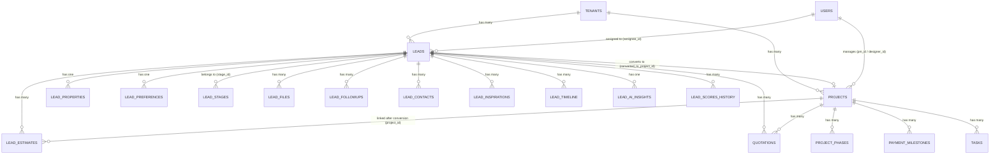
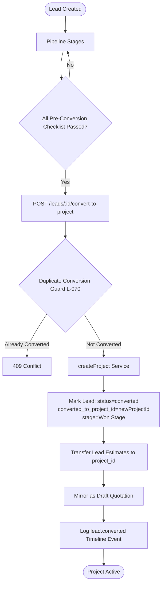

# Lead → Project Relationship

> **Module**: CRM Interior Construction  
> **Domain**: Sales Pipeline & Project Management  
> **Last Updated**: June 2026

---

## Table of Contents

1. [Overview](#overview)
2. [Entity Relationship Diagram](#entity-relationship-diagram)
3. [Data Model](#data-model)
4. [Conversion Lifecycle](#conversion-lifecycle)
5. [API Endpoints](#api-endpoints)
6. [Lead Sub-Entities](#lead-sub-entities)
7. [Conversion Workflow (Code Flow)](#conversion-workflow-code-flow)
8. [Business Rules & Guards](#business-rules--guards)
9. [Data Transfer on Conversion](#data-transfer-on-conversion)
10. [Events & Automations](#events--automations)
11. [AI Scoring & Intelligence](#ai-scoring--intelligence)
12. [Permissions](#permissions)

---

## Overview

A **Lead** represents a prospective interior design client captured at the top of the sales funnel. When a lead reaches a terminal "won" stage (booking received, floor plan shared, scope finalized, and contract signed), it can be **converted into a Project**.

The conversion is a **one-way, irreversible operation** that:
- Creates a new `projects` record linked to the original `leads` record via `converted_to_project_id`
- Marks the lead `status = 'converted'` and moves it to a `is_won = true` pipeline stage
- Transfers all lead estimates to the new project
- Mirrors estimates as draft `quotations` attached to the project
- Logs a timeline event for full audit traceability

---

## Entity Relationship Diagram



---

## Data Model

### `leads` Table (core columns)

| Column | Type | Description |
|---|---|---|
| `id` | UUID/int | Primary key |
| `tenant_id` | UUID | Multi-tenant isolation |
| `name` | TEXT | Client name |
| `phone` | TEXT | Primary phone (required) |
| `email` | TEXT | Email address |
| `source` | TEXT | Lead source (Facebook, IndiaMART, Referral, etc.) |
| `status` | TEXT | `active` \| `converted` \| `lost` |
| `stage_id` | FK → `lead_stages` | Current pipeline stage |
| `stage_updated_at` | TIMESTAMP | When stage last changed |
| `assignee_id` | FK → `users` | Assigned sales rep |
| `score` | INTEGER | Rules-based lead score (0–100) |
| `win_probability` | INTEGER | AI-calculated win probability (%) |
| `ai_score_breakdown` | JSONB | Breakdown of AI score dimensions |
| `custom_fields` | JSONB | Flexible key-value extra fields |
| `budget_min` | NUMERIC | Min budget |
| `budget_max` | NUMERIC | Max budget |
| `scope` | TEXT | Project scope description |
| `project_type` | TEXT | Type of interior project |
| `locality` | TEXT | Location/area |
| `carpet_area_sqft` | NUMERIC | Carpet area in sq ft |
| `competitor_mentioned` | BOOLEAN | Competitor risk flag |
| `dnc_flag` | BOOLEAN | Do-not-contact flag |
| `consent_whatsapp` | BOOLEAN | WhatsApp opt-in |
| `converted_to_project_id` | FK → `projects` | Set on conversion |
| `notes` | TEXT | Free-form notes |
| `deleted_at` | TIMESTAMP | Soft delete timestamp |
| `created_at` | TIMESTAMP | Creation timestamp |
| `updated_at` | TIMESTAMP | Last update timestamp |

### `projects` Table (core columns)

| Column | Type | Description |
|---|---|---|
| `id` | UUID/int | Primary key |
| `tenant_id` | UUID | Multi-tenant isolation |
| `lead_id` | FK → `leads` | Source lead |
| `name` | TEXT | Project name |
| `project_type` | TEXT | Type of project |
| `client_name` | TEXT | Inherited from lead on conversion |
| `client_phone` | TEXT | Inherited from lead |
| `client_email` | TEXT | Inherited from lead |
| `pm_id` | FK → `users` | Project Manager |
| `designer_id` | FK → `users` | Designer assigned |
| `contract_value` | NUMERIC | Agreed contract amount |
| `status` | TEXT | `active` \| `completed` \| `on_hold` |
| `start_date` | DATE | Kickoff date |
| `target_date` | DATE | Handover date |
| `site_address` | TEXT | Physical site address |
| `custom_fields` | JSONB | Pre-conversion checklist + extra data |
| `created_by` | FK → `users` | User who created / triggered conversion |
| `deleted_at` | TIMESTAMP | Soft delete timestamp |

---

## Conversion Lifecycle



### Pre-Conversion Checklist (L-069)

Before conversion is allowed, the following fields must be provided:

| Field | Required | Description |
|---|---|---|
| `booking_received` | YES | Booking amount has been received |
| `floor_plan` | YES | Floor plan shared with client |
| `scope_finalized` | YES | Project scope has been agreed |
| `projectName` | YES | Name for the new project |
| `projectType` | YES | Type of interior project |
| `contract_signed` | No | Contract signed (stored but not blocking) |
| `site_address_confirmed` | No | Site address verified (stored but not blocking) |

---

## API Endpoints

### Lead CRUD

| Method | Path | Permission | Description |
|---|---|---|---|
| `POST` | `/api/leads` | `leads:create` | Create a new lead |
| `GET` | `/api/leads` | `leads:read` | List leads (filterable, paginated) |
| `GET` | `/api/leads/stats` | `leads:read` | Lead statistics |
| `GET` | `/api/leads/:id` | `leads:read` | Get single lead |
| `PATCH` | `/api/leads/:id` | `leads:update` | Update lead fields |
| `DELETE` | `/api/leads/:id` | `leads:delete` | Soft-delete lead |
| `POST` | `/api/leads/public` | public | Public lead capture form |
| `GET` | `/api/leads/check-duplicate` | public | Duplicate check by phone/email/name |

### Lead → Project Conversion

| Method | Path | Permission | Description |
|---|---|---|---|
| `POST` | `/api/leads/:id/convert-to-project` | `leads:update` | Convert lead to a project |

**Request Body:**
```json
{
  "booking_received": true,
  "floor_plan": true,
  "scope_finalized": true,
  "contract_signed": true,
  "site_address_confirmed": true,
  "projectName": "Sharma Residence - 3BHK",
  "projectType": "residential",
  "clientName": "Rahul Sharma",
  "clientPhone": "9876543210",
  "clientEmail": "rahul@example.com",
  "pm": "<user-id>",
  "designer": "<user-id>",
  "contractValue": 1500000,
  "startDate": "2026-07-01",
  "handoverDate": "2026-12-31",
  "advanceAmount": 300000,
  "paymentTerms": "30-30-40"
}
```

**Success Response (201):**
```json
{
  "success": true,
  "data": {
    "project_id": "<new-project-id>",
    "message": "Project created successfully"
  }
}
```

**Error — Already Converted (409):**
```json
{
  "success": false,
  "error": {
    "code": "CONFLICT",
    "message": "This lead has already been converted to project <id>.",
    "data": { "existingProjectId": "<id>" }
  }
}
```

### Pipeline Stage Management

| Method | Path | Permission | Description |
|---|---|---|---|
| `POST` | `/api/leads/:id/stage` | `leads:update` | Move lead to a new stage |
| `POST` | `/api/leads/bulk/stage` | `leads:update` | Bulk stage change |

### Bulk Operations

| Method | Path | Permission | Description |
|---|---|---|---|
| `POST` | `/api/leads/bulk/delete` | `leads:delete` | Bulk soft-delete |
| `POST` | `/api/leads/bulk/assign` | `leads:update` | Bulk reassign |
| `POST` | `/api/leads/bulk/tag` | `leads:update` | Bulk tag |
| `POST` | `/api/leads/merge` | `leads:update` | Merge duplicate leads |

### Export / Import

| Method | Path | Permission | Description |
|---|---|---|---|
| `GET` | `/api/leads/export` | `leads:read` | Export leads as CSV |
| `POST` | `/api/leads/import` | `leads:create` | Bulk import via CSV |

---

## Lead Sub-Entities

### Activities & Timeline

| Method | Path | Description |
|---|---|---|
| `POST` | `/api/leads/:id/activities` | Log a sales activity (call, meeting, site visit, etc.) |
| `GET` | `/api/leads/:id/activities` | List activities with pagination |
| `GET` | `/api/leads/:id/timeline` | Combined system + user event timeline |
| `GET` | `/api/leads/:id/automation-events` | View automation trigger history |

### Files

| Method | Path | Description |
|---|---|---|
| `POST` | `/api/leads/:id/files` | Upload file (JPEG/PNG/PDF, max 10MB per file, 50MB total) |
| `GET` | `/api/leads/:id/files` | List files with signed download URLs |
| `DELETE` | `/api/leads/:id/files/:fileId` | Delete a file |
| `POST` | `/api/leads/:id/files/:fileId/parse` | AI parse document (Gemini) |

### Follow-ups

| Method | Path | Description |
|---|---|---|
| `GET` | `/api/leads/:id/followups` | List scheduled follow-ups |
| `POST` | `/api/leads/:id/followups` | Create follow-up |
| `PATCH` | `/api/leads/:id/followups/:fid` | Update / mark done |
| `DELETE` | `/api/leads/:id/followups/:fid` | Delete follow-up |

### Estimates (Native Estimator Integration)

| Method | Path | Description |
|---|---|---|
| `POST` | `/api/leads/:id/estimates` | Create native estimate |
| `GET` | `/api/leads/:id/estimates` | List estimates |
| `POST` | `/api/leads/:id/estimates/sync` | Sync estimates from estimator |
| `POST` | `/api/leads/:id/estimates/webhook` | Estimator webhook (HMAC-verified) |

### Multi-Contact Management

| Method | Path | Description |
|---|---|---|
| `GET` | `/api/leads/:id/contacts` | List additional contacts |
| `POST` | `/api/leads/:id/contacts` | Add contact (spouse, co-owner, etc.) |
| `DELETE` | `/api/leads/:id/contacts/:cid` | Remove a contact |

### Communications Hub

| Method | Path | Description |
|---|---|---|
| `GET` | `/api/leads/:id/communications` | List communications |
| `POST` | `/api/leads/:id/communications` | Log communication |
| `POST` | `/api/leads/:id/communications/draft` | AI-draft communication |

### Inspiration Board

| Method | Path | Description |
|---|---|---|
| `GET` | `/api/leads/:id/inspirations` | List inspiration images |
| `POST` | `/api/leads/:id/inspirations` | Add inspiration |
| `DELETE` | `/api/leads/:id/inspirations/:iid` | Remove inspiration |

### Proposal & Negotiation

| Method | Path | Description |
|---|---|---|
| `POST` | `/api/leads/:id/generate-proposal` | Generate formatted proposal |
| `GET` | `/api/leads/:id/proposals` | List generated proposals |
| `PATCH` | `/api/leads/:id/negotiation` | Update negotiation state |
| `PATCH` | `/api/leads/:id/budget` | Update budget range |

---

## Conversion Workflow (Code Flow)

### Conversion Call Chain

```
POST /api/leads/:id/convert-to-project
  └── leadController.convertToProjectHandler()
        ├── 1. Validate checklist fields (L-069)
        ├── 2. pool.query SELECT * FROM leads WHERE id=...
        ├── 3. Duplicate conversion guard (L-070)
        │     └── leads.status === 'converted' && leads.converted_to_project_id → 409
        ├── 4. createProject({ lead_id, name, project_type, ... })
        │     └── services/projects/createProject.js
        │           └── ProjectRepository.createProject()
        │                 └── INSERT INTO projects (...) RETURNING *
        ├── 5. UPDATE leads SET status='converted', converted_to_project_id=..., stage_id=<won_stage>
        ├── 6. SELECT * FROM lead_estimates WHERE lead_id=...
        │     ├── UPDATE lead_estimates SET project_id=<newProjectId>
        │     └── INSERT INTO quotations (lead_id, project_id, total_amount, status='draft')
        └── 7. INSERT INTO lead_timeline (event_type='lead.converted', summary=...)
```

### Stage Change Call Chain

```
POST /api/leads/:id/stage
  └── leadController.changeStageHandler()
        └── services/leads/changeStage.changeStage()
              ├── leadRepository.findLeadById()            -- get current lead
              ├── stageRepository.getStageById()           -- fetch target stage config
              ├── services/leads/updateLead.updateLead()   -- enforce mandatory_fields gate
              │     └── missing fields → STAGE_GATE_FAILED (422)
              ├── logAction('lead.stage_changed', ...)     -- audit log
              ├── eventBus.emit('lead.stage_changed', ...) -- domain event (async)
              ├── dispatchEvent(tenantId, ...)             -- outbound webhook
              └── leadRepository.refreshPipelineSummary() -- refresh materialized view
```

---

## Business Rules & Guards

### L-069: Pre-Conversion Mandatory Fields

The following fields must be present and truthy in the request body:

```
booking_received  === true   (required)
floor_plan        === true   (required)
scope_finalized   === true   (required)
projectName       not empty  (required)
projectType       not empty  (required)
```

Returns `400 VALIDATION_ERROR` with the list of `missingFields` if any are absent.

### L-070: Duplicate Conversion Guard

A lead can only be converted **once**. If `lead.status === 'converted'` and `lead.converted_to_project_id` is already set, the API returns HTTP **409 Conflict**.

### Stage Gate Enforcement

Each `lead_stages` record can define `mandatory_fields[]`. When a lead is moved to a stage, all mandatory fields must be populated in the lead data. If not, the API returns HTTP **422** with:
```json
{
  "code": "STAGE_GATE_FAILED",
  "message": "Missing mandatory fields",
  "missing": ["budget_max", "locality"]
}
```

### Optimistic Locking

On `PATCH /api/leads/:id`, if the client sends `updated_at`, it is compared to the DB record. A discrepancy > 1 second raises `OPTIMISTIC_LOCK_FAILED` to prevent stale writes.

### Duplicate Detection on Create

New leads are rejected if an existing (non-deleted) lead matches:
1. Same `phone`
2. Same `email`
3. Same `name` + `locality/address`

---

## Data Transfer on Conversion

| Source (`leads`) | Destination (`projects`) | Fallback Behaviour |
|---|---|---|
| `name` | `client_name` | Used if not supplied in request |
| `phone` | `client_phone` | Used if not supplied in request |
| `email` | `client_email` | Used if not supplied in request |
| `budget_max` | `contract_value` | Used if not supplied in request |
| `id` | `lead_id` | Hard FK — always set |
| Checklist booleans | `custom_fields.*` | Stored verbatim |

**Estimate Transfer:**
- Each `lead_estimates` row receives `project_id = <newProjectId>`
- A `quotations` row is inserted with `status = 'draft'` if none exists for that `(lead_id, project_id)` pair

---

## Events & Automations

| Event Name | Trigger | Side Effects |
|---|---|---|
| `lead.created` | New lead created | Audit log, automation queue, webhooks |
| `lead.updated` | Lead fields changed | Audit log, webhooks, assignee notification |
| `lead.stage_changed` | Stage moved | Audit log, eventBus, webhooks, pipeline summary refresh |
| `lead.converted` | Conversion complete | Timeline log, estimate + quotation transfer |
| `lead.file_uploaded` | File attached | eventBus notification |
| `lead.estimates_synced` | Estimator webhook received | eventBus notification |

All major events call `dispatchEvent(tenantId, eventType, payload)` for outbound webhooks. Stage changes and lead creation also push to the **automation queue** which powers rule-based workflows (auto-assign, email sequences, follow-up scheduling).

---

## AI Scoring & Intelligence

### Rules-Based Score (0–100)

Computed by `scoreLeadService.scoreLead()` using per-tenant `lead_scoring_rules` rows.

Supported operators: `eq`, `neq`, `contains`, `is_not_empty`, `gt`, `lt`

### AI Win Probability (0–99%)

Computed by `calculateAIScore()`:

| Dimension | Signal Used |
|---|---|
| Budget Fit | `budget_max > 0`, `loan_approved` |
| Timeline | `possession_date` proximity (≤3 months = high urgency) |
| Property Readiness | `house_status` (ready/possession_taken = high score) |
| Decision Readiness | Filled: `interior_style`, `material_preference`, `property_type`, `carpet_area_sqft` |
| Engagement | `days_in_stage` (< 3 days = active) |
| Responsiveness | Same as Engagement |
| Risk Level | `competitor_mentioned` → score penalty |

### Async Intelligence Refresh

After any activity is logged, an async job calls `analyzeLeadIntelligence()` and updates:
- `leads.score` and `leads.win_probability`
- `leads.ai_score_breakdown`
- `leads.custom_fields.ai_recommendation` (next action, sentiment, objections, signals)
- `lead_scores_history` (score history record)

### AI Feature Endpoints

| Endpoint | Feature |
|---|---|
| `GET /:id/ai-insights` | Overall intelligence analysis |
| `POST /:id/ai-design-proposal` | Interior design proposal generation |
| `POST /:id/meeting-summary` | AI meeting transcript summarization |
| `POST /:id/budget-planner` | Budget breakdown recommendation |
| `POST /:id/sales-coach` | Objection handling guidance |
| `POST /:id/knowledge-assistant` | Q&A against lead context |
| `POST /:id/buying-intent` | Buy-readiness classification |
| `POST /:id/sentiment` | Communication sentiment analysis |
| `POST /:id/ai-twin` | AI persona simulation |

---

## Permissions

| Permission | Operations Covered |
|---|---|
| `leads:create` | Create leads, bulk CSV import |
| `leads:read` | List, view, export leads and sub-entities |
| `leads:update` | Edit, stage change, convert, upload files, follow-ups, contacts |
| `leads:delete` | Soft-delete, bulk delete |
| `leads:read_sensitive` | View phone, email, budget (masked otherwise) |

### Manager Role Routes

Require role `manager` or `gm`:

| Route | Description |
|---|---|
| `GET /leads/manager/sla-breaches` | Leads past SLA thresholds |
| `GET /leads/manager/pipeline-movement` | Funnel velocity report |
| `GET /leads/manager/rep-capacity` | Sales rep workload view |
| `GET /leads/manager/score-distribution` | Score analytics |
| `GET /leads/manager/pending-approvals` | Leads awaiting manager sign-off |
| `GET /leads/manager/scheduled-visits` | Upcoming site visits |
| `GET /leads/manager/predictive-revenue` | Forecasted revenue |
| `GET /leads/manager/heat-map` | Geographic lead density map |
| `POST /leads/manager/approvals/:id/decide` | Approve or reject a lead |

---

## Related Source Files

| File | Purpose |
|---|---|
| `server/src/controllers/leadController.js` | All HTTP handler functions |
| `server/src/routes/leads.js` | Route definitions and middleware |
| `server/src/repositories/leadRepository.js` | DB queries for leads |
| `server/src/repositories/projectRepository.js` | DB queries for projects |
| `server/src/services/leads/createLead.js` | Lead creation orchestration |
| `server/src/services/leads/updateLead.js` | Lead update + stage gate enforcement |
| `server/src/services/leads/changeStage.js` | Stage transition orchestration |
| `server/src/services/leads/scoreLeadService.js` | Rules-based and AI scoring |
