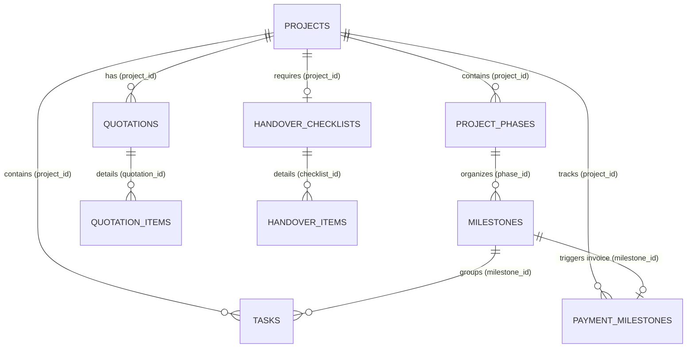
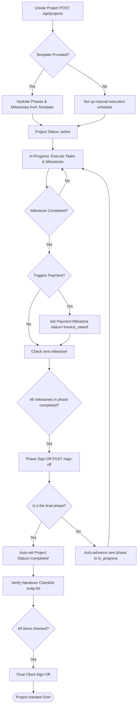

# Project Module Documentation

This document describes the architectural layout, database schemas, API interfaces, business rules, and service workflows for the **Project Execution & Delivery Module** of the CRM.

---

## 1. Module Overview

The **Project Module** handles the execution lifecycle of interior design and construction projects. A project is created in one of two ways:
1. **Directly**: Via `POST /api/projects` (with an optional template).
2. **Via Lead Conversion**: Automated creation when a qualified lead is won via `POST /api/leads/:id/convert-to-project`.

Once a project becomes active, it manages the execution phase through a hierarchical structure of **Phases → Milestones → Tasks**, alongside financial tracking via **Payment Milestones** and **Quotations (BOQ)**, and delivery validation via a **Handover Checklist**.

---

## 2. Entity Relationship Diagram

The following diagram illustrates the relationship between a Project and its sub-entities:



---

## 3. Database Schema Definitions

### Core Project Table (`projects`)
Defined in [009_projects.sql](file:///d:/Digicloudify%20softwares/CRM-Interior-Construction/server/migrations/009_projects.sql):
* `id` (UUID, Primary Key)
* `tenant_id` (UUID, Foreign Key to `tenants`)
* `lead_id` (UUID, Foreign Key to `leads`, nullable)
* `client_name` (VARCHAR, client name copied on creation/conversion)
* `client_phone` (VARCHAR)
* `client_email` (VARCHAR)
* `name` (VARCHAR, project name)
* `project_type` (VARCHAR, e.g., `'residential'`, `'commercial'`)
* `pm_id` (UUID, Foreign Key to `users` representing the Project Manager)
* `designer_id` (UUID, Foreign Key to `users` representing the Designer)
* `contract_value` (DECIMAL, overall project budget)
* `status` (VARCHAR, defaults to `'active'`, values: `'active'`, `'on_hold'`, `'completed'`, `'cancelled'`)
* `start_date` (DATE)
* `target_date` (DATE, handover target)
* `site_address` (TEXT)
* `custom_fields` (TEXT, JSONB data storing extra checklist details)

### Project Phases (`project_phases`)
Defined in [010_project_phases.sql](file:///d:/Digicloudify%20softwares/CRM-Interior-Construction/server/migrations/010_project_phases.sql):
* `id` (UUID, Primary Key)
* `project_id` (UUID, Foreign Key to `projects`)
* `name` (VARCHAR, e.g., `'Civil Work'`, `'False Ceiling'`)
* `sort_order` (INTEGER, execution order sequence)
* `status` (VARCHAR, defaults to `'pending'`, values: `'pending'`, `'in_progress'`, `'completed'`)
* `duration_days` (INTEGER)
* `starts_at` (DATE)
* `ends_at` (DATE)
* `sign_off_required` (BOOLEAN, if PM or Client sign-off is needed)
* `sign_off_by` (VARCHAR, `'pm'` or `'client'`)
* `signed_off_by` (UUID, Foreign Key to `users`)
* `signed_off_at` (TIMESTAMP)

### Construction Milestones (`milestones`)
Defined in [011_milestones.sql](file:///d:/Digicloudify%20softwares/CRM-Interior-Construction/server/migrations/011_milestones.sql):
* `id` (UUID, Primary Key)
* `phase_id` (UUID, Foreign Key to `project_phases`)
* `project_id` (UUID, Foreign Key to `projects`)
* `name` (VARCHAR, e.g., `'Tiling Completed'`)
* `description` (TEXT)
* `status` (VARCHAR, defaults to `'pending'`, values: `'pending'`, `'completed'`)
* `due_date` (DATE)
* `completion_date` (DATE)
* `completed_by` (UUID, Foreign Key to `users`)
* `triggers_payment` (BOOLEAN, if true, completion updates the linked invoice)
* `sort_order` (INTEGER)

### Financial Payment Schedule (`payment_milestones`)
Defined in [015_payment_milestones.sql](file:///d:/Digicloudify%20softwares/CRM-Interior-Construction/server/migrations/015_payment_milestones.sql):
* `id` (UUID, Primary Key)
* `project_id` (UUID, Foreign Key to `projects`)
* `milestone_id` (UUID, Foreign Key to `milestones`, optional link to execution)
* `name` (VARCHAR, e.g., `'Booking Advance'`, `'Tiling Stage'`)
* `amount` (DECIMAL, absolute cash amount)
* `percentage` (DECIMAL, percentage of total contract value)
* `due_date` (DATE)
* `status` (VARCHAR, defaults to `'scheduled'`, values: `'scheduled'`, `'invoice_raised'`, `'paid'`)
* `invoice_reference` (VARCHAR)
* `paid_at` (TIMESTAMP)
* `paid_amount` (DECIMAL)

### Bill of Quantities / Quotations (`quotations` & `quotation_items`)
Defined in [056_boq_and_quotations.sql](file:///d:/Digicloudify%20softwares/CRM-Interior-Construction/server/migrations/056_boq_and_quotations.sql):
* `quotations` stores metadata, totals, taxes, and status (`'draft'`, `'sent'`, `'accepted'`, `'rejected'`, `'revised'`).
* `quotation_items` records BOQ lines, including dimensions, rooms/zones, quantities, unit prices, markup percentages, and materials specifications.

---

## 4. Execution Lifecycle

A project transitions through several states from kickoff to sign-off:



---

## 5. API Interface Definition

### Project Management Core
* **Create Project**: `POST /api/projects`
  - *Controller Handler*: [createProject](file:///d:/Digicloudify%20softwares/CRM-Interior-Construction/server/src/services/projects/createProject.js#L7)
  - *Permission*: `projects:create`
* **Get Details**: `GET /api/projects/:id`
  - Fetches project records joined with stats (task completion %, payments collected vs overall value).
* **Update Project**: `PATCH /api/projects/:id`
  - *Controller Handler*: [updateProject](file:///d:/Digicloudify%20softwares/CRM-Interior-Construction/server/src/services/projects/updateProject.js#L7)
  - Updates PM, Designer, Target Dates, etc.

### Phases & Milestones
* **Phase Reordering**: `PATCH /api/projects/:projectId/phases/reorder`
* **Phase Sign-Off**: `POST /api/projects/:projectId/phases/:phaseId/sign-off`
  - *Service Handler*: [completePhase](file:///d:/Digicloudify%20softwares/CRM-Interior-Construction/server/src/services/projects/completePhase.js#L7)
* **Milestone Completion**: `POST /api/phases/:phaseId/milestones/:mid/complete`
  - Marks execution milestone complete. Triggers linked payment invoice.

### Payment Milestones
* **List Milestones**: `GET /api/projects/:id/payment-milestones`
* **Record Payment**: `PATCH /api/payment-milestones/:id`
  - Updates status to `'paid'`, records reference ID and date.

### Handover Checklist
* **Get Snag List**: `GET /api/projects/:id/handover/checklists`
* **Add Snag Item**: `POST /api/projects/:id/handover/items`
* **Sign-Off Handover**: `POST /api/handover/checklists/:id/sign-off`
  - Validates that all items are checked off before allowing project completion.

---

## 6. Service Call Workflows & DB Transactions

### 6.1 Phase Sign-Off & Automation Call Flow
Defined in [completePhase.js](file:///d:/Digicloudify%20softwares/CRM-Interior-Construction/server/src/services/projects/completePhase.js):
1. **Validation**: Checks if phase exists and if all associated milestones are marked `'completed'`.
2. **Phase DB Update**:
   ```sql
   UPDATE project_phases 
   SET status = 'completed', signed_off_by = $1, signed_off_at = NOW() 
   WHERE id = $2
   ```
3. **Cascade Updates**:
   - Finds the next phase (by `sort_order + 1`) and updates its status to `'in_progress'`.
   - If no further phases exist, automatically marks the parent project `status = 'completed'`.
4. **Side Effects**: Enqueues notification events to alert assigned Project Managers.

### 6.2 Milestone Completion & Payment Trigger Flow
Managed via [milestoneRepository.js](file:///d:/Digicloudify%20softwares/CRM-Interior-Construction/server/src/repositories/milestoneRepository.js):
1. Updates milestone:
   ```sql
   UPDATE milestones 
   SET status = 'completed', completion_date = NOW(), completed_by = $1 
   WHERE id = $2
   ```
2. Checks if `triggers_payment` is true. If yes, it searches for a linked `payment_milestones` record and updates its status:
   ```sql
   UPDATE payment_milestones 
   SET status = 'invoice_raised' 
   WHERE milestone_id = $1 AND status = 'scheduled'
   ```

### 6.3 BOQ Total Calculations
Managed via [quotationService.js](file:///d:/Digicloudify%20softwares/CRM-Interior-Construction/server/src/services/projects/quotationService.js):
- Whenever a quotation line item (`quotation_items`) is added, updated, or deleted, the system queries the aggregate cost and updates the parent quotation record:
  ```sql
  subtotal = SUM(quantity * unit_price * (1 + markup/100))
  total_amount = subtotal + tax_amount - discount_amount
  ```

---

## 7. Relevant Code Files & Implementation References

The project management modules are implemented across the following source files:

* **Routes**:
  - [projects.js](file:///d:/Digicloudify%20softwares/CRM-Interior-Construction/server/src/routes/projects.js) — Base project routes
  - [phases.js](file:///d:/Digicloudify%20softwares/CRM-Interior-Construction/server/src/routes/phases.js) — Phase routes & drag-and-drop ordering
  - [milestones.js](file:///d:/Digicloudify%20softwares/CRM-Interior-Construction/server/src/routes/milestones.js) — Milestone routes
  - [paymentMilestones.js](file:///d:/Digicloudify%20softwares/CRM-Interior-Construction/server/src/routes/paymentMilestones.js) — Payment logging routes
  - [handover.js](file:///d:/Digicloudify%20softwares/CRM-Interior-Construction/server/src/routes/handover.js) — Handover checklist routes
* **Services**:
  - [createProject.js](file:///d:/Digicloudify%20softwares/CRM-Interior-Construction/server/src/services/projects/createProject.js) — Project initialization and transaction handling
  - [updateProject.js](file:///d:/Digicloudify%20softwares/CRM-Interior-Construction/server/src/services/projects/updateProject.js) — Audited update controller
  - [completePhase.js](file:///d:/Digicloudify%20softwares/CRM-Interior-Construction/server/src/services/projects/completePhase.js) — Phase sign-off cascade operations
  - [paymentMilestoneService.js](file:///d:/Digicloudify%20softwares/CRM-Interior-Construction/server/src/services/projects/paymentMilestoneService.js) — Installment logging
  - [quotationService.js](file:///d:/Digicloudify%20softwares/CRM-Interior-Construction/server/src/services/projects/quotationService.js) — BOQ computations
* **Repositories**:
  - [projectRepository.js](file:///d:/Digicloudify%20softwares/CRM-Interior-Construction/server/src/repositories/projectRepository.js) — DB mappings for projects
  - [phaseRepository.js](file:///d:/Digicloudify%20softwares/CRM-Interior-Construction/server/src/repositories/phaseRepository.js) — DB mappings for phases
  - [milestoneRepository.js](file:///d:/Digicloudify%20softwares/CRM-Interior-Construction/server/src/repositories/milestoneRepository.js) — DB mappings for milestones
