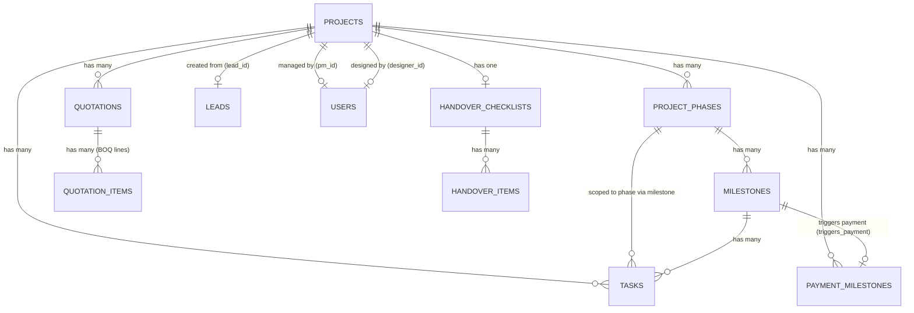
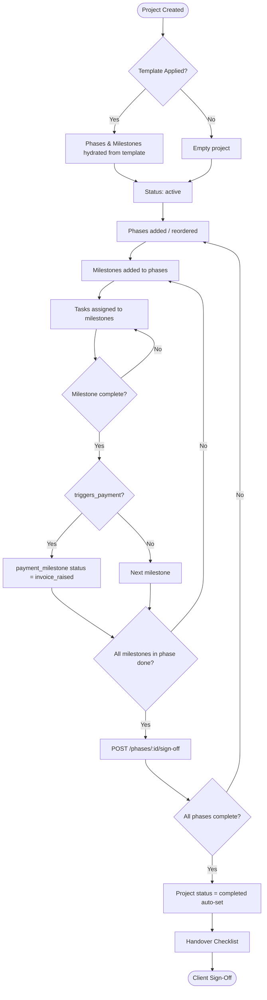

# Project Module

> **Module**: CRM Interior Construction  
> **Domain**: Project Execution & Delivery  
> **Last Updated**: June 2026

---

## Table of Contents

1. [Overview](#overview)
2. [Entity Relationship Diagram](#entity-relationship-diagram)
3. [Data Model](#data-model)
4. [Project Lifecycle](#project-lifecycle)
5. [API Endpoints](#api-endpoints)
6. [Phases](#phases)
7. [Milestones](#milestones)
8. [Payment Milestones](#payment-milestones)
9. [Handover Checklist](#handover-checklist)
10. [Quotations](#quotations)
11. [Nested Routes — Tasks & Documents](#nested-routes--tasks--documents)
12. [Service Call Flows](#service-call-flows)
13. [Events & Automations](#events--automations)
14. [Permissions](#permissions)

---

## Overview

The **Project** module manages the execution lifecycle of interior design projects. A project is created either:

1. **Directly** — via `POST /api/projects` with a template
2. **Via Lead Conversion** — when a qualified lead is converted through `POST /api/leads/:id/convert-to-project`

Once active, a project is organized into **Phases → Milestones → Tasks** with supporting **Payment Milestones**, **Documents**, a **Quotation (BOQ)**, and a **Handover Checklist**.

---

## Entity Relationship Diagram



---

## Data Model

### `projects`

| Column | Type | Description |
|---|---|---|
| `id` | UUID | Primary key |
| `tenant_id` | UUID | Multi-tenant isolation |
| `lead_id` | FK → `leads` | Source lead (if converted from a lead) |
| `name` | TEXT | Project name |
| `project_type` | TEXT | Type of interior project (e.g. residential, commercial) |
| `client_name` | TEXT | Client name |
| `client_phone` | TEXT | Client phone |
| `client_email` | TEXT | Client email |
| `pm_id` | FK → `users` | Project Manager |
| `designer_id` | FK → `users` | Assigned designer |
| `contract_value` | NUMERIC | Total agreed contract amount |
| `status` | TEXT | `active` \| `completed` \| `on_hold` |
| `start_date` | DATE | Project kickoff date |
| `target_date` | DATE | Handover / completion date |
| `site_address` | TEXT | Physical site address |
| `custom_fields` | JSONB | Checklist flags and extra metadata |
| `created_by` | FK → `users` | User who created the project |
| `deleted_at` | TIMESTAMP | Soft delete timestamp |
| `created_at` | TIMESTAMP | Record creation time |
| `updated_at` | TIMESTAMP | Last update time |

### `project_phases`

| Column | Type | Description |
|---|---|---|
| `id` | UUID | Primary key |
| `tenant_id` | UUID | Multi-tenant isolation |
| `project_id` | FK → `projects` | Parent project |
| `name` | TEXT | Phase name (e.g. Civil Work, Electrical) |
| `sort_order` | INTEGER | Display / execution order |
| `status` | TEXT | `pending` \| `in_progress` \| `completed` |
| `duration_days` | INTEGER | Planned duration in days |
| `starts_at` | DATE | Planned start date |
| `ends_at` | DATE | Planned end date |
| `sign_off_required` | BOOLEAN | Whether PM sign-off is needed to complete |
| `sign_off_by` | TEXT | Who signs off: `pm` or `client` |
| `signed_off_by` | FK → `users` | User who signed off |
| `signed_off_at` | TIMESTAMP | Time of sign-off |

### `milestones`

| Column | Type | Description |
|---|---|---|
| `id` | UUID | Primary key |
| `tenant_id` | UUID | Multi-tenant isolation |
| `phase_id` | FK → `project_phases` | Parent phase |
| `project_id` | FK → `projects` | Parent project |
| `name` | TEXT | Milestone name |
| `description` | TEXT | Optional description |
| `status` | TEXT | `pending` \| `completed` |
| `due_date` | DATE | Target completion date |
| `completion_date` | DATE | Actual completion date |
| `completed_by` | FK → `users` | User who completed it |
| `triggers_payment` | BOOLEAN | If true, completing this milestone raises a payment invoice |
| `sort_order` | INTEGER | Display order within phase |

### `payment_milestones`

| Column | Type | Description |
|---|---|---|
| `id` | UUID | Primary key |
| `tenant_id` | UUID | Multi-tenant isolation |
| `project_id` | FK → `projects` | Parent project |
| `milestone_id` | FK → `milestones` | Linked construction milestone (optional) |
| `name` | TEXT | Payment milestone name |
| `amount` | NUMERIC | Fixed payment amount |
| `percentage` | NUMERIC | Percentage of contract value |
| `due_date` | DATE | Payment due date |
| `status` | TEXT | `scheduled` \| `invoice_raised` \| `paid` |
| `invoice_reference` | TEXT | Invoice / reference number |
| `paid_at` | TIMESTAMP | When payment was received |
| `paid_amount` | NUMERIC | Actual amount received |
| `notes` | TEXT | Payment notes |

### `quotations`

| Column | Type | Description |
|---|---|---|
| `id` | UUID | Primary key |
| `tenant_id` | UUID | Multi-tenant isolation |
| `project_id` | FK → `projects` | Parent project |
| `lead_id` | FK → `leads` | Source lead (if from conversion) |
| `quotation_number` | TEXT | Quotation reference number |
| `status` | TEXT | `draft` \| `sent` \| `approved` \| `rejected` |
| `subtotal` | NUMERIC | Sum of BOQ line items |
| `tax_amount` | NUMERIC | Tax applied |
| `discount_amount` | NUMERIC | Discount applied |
| `total_amount` | NUMERIC | Final total |
| `valid_until` | DATE | Quotation expiry date |
| `notes` | TEXT | Notes to client |
| `terms_conditions` | TEXT | T&C text |

### `quotation_items` (BOQ Lines)

| Column | Type | Description |
|---|---|---|
| `id` | UUID | Primary key |
| `quotation_id` | FK → `quotations` | Parent quotation |
| `parent_item_id` | FK → `quotation_items` | For grouped / nested BOQ items |
| `room_or_area` | TEXT | Room or zone (Living Room, Kitchen, etc.) |
| `item_name` | TEXT | Work item name |
| `description` | TEXT | Detailed description |
| `unit` | TEXT | Unit of measurement (sqft, nos, RFT) |
| `quantity` | NUMERIC | Quantity |
| `unit_price` | NUMERIC | Price per unit |
| `markup_percentage` | NUMERIC | Markup % applied |
| `total_price` | NUMERIC | Computed: quantity × unit_price × markup |
| `material_specifications` | TEXT | Material spec notes |
| `brand` | TEXT | Brand name |
| `sort_order` | INTEGER | Line item order |

---

## Project Lifecycle



---

## API Endpoints

### Project CRUD

| Method | Path | Permission | Description |
|---|---|---|---|
| `POST` | `/api/projects` | `projects:create` | Create a new project |
| `GET` | `/api/projects` | `projects:read` | List projects (filterable, paginated) |
| `GET` | `/api/projects/:id` | `projects:read` | Get project details + stats |
| `PATCH` | `/api/projects/:id` | `projects:update` | Update project fields |
| `DELETE` | `/api/projects/:id` | `projects:delete` | Soft-delete project |

**Create Project — Request Body:**
```json
{
  "name": "Sharma Residence - 3BHK",
  "client_name": "Rahul Sharma",
  "client_phone": "9876543210",
  "client_email": "rahul@example.com",
  "project_type": "residential",
  "pm_id": "<user-uuid>",
  "designer_id": "<user-uuid>",
  "contract_value": 1500000,
  "start_date": "2026-07-01",
  "target_date": "2026-12-31",
  "site_address": "Flat 4B, Prestige Tower, Bangalore",
  "templateId": "<template-uuid>"
}
```

**List Query Parameters:**

| Param | Type | Description |
|---|---|---|
| `status` | string | Filter by status (`active`, `completed`, `on_hold`) |
| `pmId` | UUID | Filter by Project Manager |
| `designerId` | UUID | Filter by Designer |
| `search` | string | Search by project name or client name |
| `page` | int | Page number (default: 1) |
| `limit` | int | Page size (default: 20) |

**GET /:id response includes:**
- Full project record with `pm_name`, `designer_name`
- `phases[]` with `milestone_count` and `task_count`
- `payment_milestones[]`
- `stats` — task completion %, overdue tasks, collected vs total payment

---

### Template Application

| Method | Path | Permission | Description |
|---|---|---|---|
| `POST` | `/api/projects/:id/apply-template` | `projects:manage` | Apply a phase/milestone template to an existing project |

**Request Body:**
```json
{ "templateId": "<template-uuid>" }
```

---

## Phases

Phases organize the project into execution stages (e.g. Civil Work, Electrical, False Ceiling, Painting, Handover).

| Method | Path | Permission | Description |
|---|---|---|---|
| `GET` | `/api/projects/:projectId/phases` | `projects:read` | List phases with milestone and task counts |
| `POST` | `/api/projects/:projectId/phases` | `projects:manage` | Create a new phase |
| `PUT` | `/api/projects/:projectId/phases/:phaseId` | `projects:manage` | Update a phase |
| `DELETE` | `/api/projects/:projectId/phases/:phaseId` | `projects:manage` | Delete a phase |
| `PATCH` | `/api/projects/:projectId/phases/reorder` | `projects:manage` | Reorder phases by drag-and-drop |
| `POST` | `/api/projects/:projectId/phases/:phaseId/sign-off` | `projects:manage` | Sign off / complete a phase |

**Create Phase — Request Body:**
```json
{
  "name": "Civil Work",
  "sort_order": 1,
  "duration_days": 30,
  "sign_off_required": true,
  "sign_off_by": "pm"
}
```

### Phase Sign-Off Rules

- All milestones in the phase must have `status = 'completed'` before sign-off
- If any are incomplete, returns `422 MILESTONES_INCOMPLETE` with the list of incomplete milestone names
- On success:
  - Phase `status` → `completed`, `signed_off_by` and `signed_off_at` set
  - Next phase (by `sort_order + 1`) auto-advances to `in_progress`
  - If **all phases** are now complete, the parent project `status` is automatically set to `completed`
  - PM is notified via in-app notification
  - `project.phase_completed` webhook is dispatched
  - Audit log entry created

---

## Milestones

Milestones are sub-deliverables within a phase. Completing a milestone can optionally trigger a payment invoice.

| Method | Path | Permission | Description |
|---|---|---|---|
| `GET` | `/api/phases/:phaseId/milestones` | `projects:read` | List milestones for a phase |
| `POST` | `/api/phases/:phaseId/milestones` | `projects:manage` | Create a milestone |
| `PATCH` | `/api/phases/:phaseId/milestones/:mid` | `projects:manage` | Update a milestone |
| `DELETE` | `/api/phases/:phaseId/milestones/:mid` | `projects:manage` | Delete a milestone |
| `POST` | `/api/phases/:phaseId/milestones/:mid/complete` | `projects:manage` | Mark milestone as complete |

**Create Milestone — Request Body:**
```json
{
  "name": "Floor Tiling Complete",
  "description": "All rooms floor tiles laid and grouted",
  "due_date": "2026-08-15",
  "triggers_payment": true,
  "sort_order": 2
}
```

**Complete Milestone Response:**
```json
{
  "success": true,
  "data": {
    "milestone": { "...milestone object..." },
    "paymentTriggered": true
  }
}
```

### Payment Trigger Chain

When a milestone with `triggers_payment = true` is completed:
```
completeMilestone()
  └── UPDATE milestones SET status='completed', completion_date=...
  └── IF triggers_payment → UPDATE payment_milestones SET status='invoice_raised'
        WHERE milestone_id = <this id> AND status = 'scheduled'
```

---

## Payment Milestones

Financial schedule linked to project execution. Each record represents one payment installment.

| Method | Path | Permission | Description |
|---|---|---|---|
| `GET` | `/api/projects/:id/payment-milestones` | `projects:read` | List payment milestones for a project |
| `POST` | `/api/payment-milestones` | `projects:manage` | Create a payment milestone |
| `PATCH` | `/api/payment-milestones/:id` | `projects:manage` | Update status, mark as paid |

**Create Payment Milestone — Request Body:**
```json
{
  "projectId": "<project-uuid>",
  "name": "Booking Advance",
  "amount": 300000,
  "percent": 20,
  "dueDate": "2026-07-10",
  "milestoneId": "<milestone-uuid>",
  "notes": "20% advance on booking"
}
```

**Update (Mark Paid) — Request Body:**
```json
{
  "status": "paid",
  "invoice_reference": "INV-2026-001",
  "paid_at": "2026-07-12T10:30:00Z",
  "paid_amount": 300000
}
```

**Payment Milestone Statuses:**

| Status | Meaning |
|---|---|
| `scheduled` | Upcoming, not yet due |
| `invoice_raised` | Auto-triggered by linked milestone completion |
| `paid` | Payment received and confirmed |

---

## Handover Checklist

A room-by-room snagging and handover checklist completed before client sign-off.

| Method | Path | Permission | Description |
|---|---|---|---|
| `GET` | `/api/projects/:id/handover/checklists` | `projects:read` | Get handover checklist for a project |
| `POST` | `/api/projects/:id/handover/checklists` | `projects:manage` | Create a handover checklist |
| `POST` | `/api/projects/:id/handover/items` | `projects:manage` | Add an item to the checklist |
| `PATCH` | `/api/handover/items/:itemId` | `projects:manage` | Mark item as checked / attach photo |
| `POST` | `/api/handover/checklists/:id/sign-off` | `projects:manage` | Client final sign-off |

**Create Checklist — Request Body:**
```json
{
  "items": [
    { "room": "Living Room", "description": "Check wall paint finish" },
    { "room": "Kitchen", "description": "Verify cabinet alignment" }
  ]
}
```

**Update Checklist Item — Request Body:**
```json
{
  "checklistId": "<checklist-uuid>",
  "is_checked": true,
  "photo_key": "tenant-1/handover/living-room-check.jpg"
}
```

**Sign-Off Rules:**
- All checklist items must be `is_checked = true` before sign-off
- Returns `400 BAD_REQUEST` with message `All items must be checked before sign-off` if incomplete
- On success, checklist is marked as client-signed

---

## Quotations

BOQ (Bill of Quantities) document attached to a project. A draft quotation is auto-created when a lead is converted.

**Quotation lifecycle:** `draft` → `sent` → `approved` / `rejected`

**Totals Auto-Calculation:**
When a BOQ line item is added or updated, `updateQuotationTotals()` recalculates:
```
subtotal       = SUM(total_price) of all quotation_items
total_amount   = subtotal + tax_amount - discount_amount
```

---

## Nested Routes — Tasks & Documents

Tasks and Documents are mounted as nested routers under `/api/projects/:projectId/`:

### Tasks

| Method | Path | Permission | Description |
|---|---|---|---|
| `GET` | `/api/projects/:projectId/tasks` | `projects:read` | List tasks for a project |
| `POST` | `/api/projects/:projectId/tasks` | `projects:manage` | Create a task |
| `PATCH` | `/api/projects/:projectId/tasks/:id` | `projects:manage` | Update task |
| `DELETE` | `/api/projects/:projectId/tasks/:id` | `projects:manage` | Delete task |

### Documents

| Method | Path | Permission | Description |
|---|---|---|---|
| `GET` | `/api/projects/:projectId/documents` | `projects:read` | List project documents |
| `POST` | `/api/projects/:projectId/documents` | `projects:manage` | Upload a document |
| `DELETE` | `/api/projects/:projectId/documents/:id` | `projects:manage` | Delete a document |

---

## Service Call Flows

### Create Project

```
POST /api/projects
  └── createProject({ tenantId, userId, data })
        ├── 1. BEGIN transaction
        ├── 2. projectRepository.createProject()
        │     └── INSERT INTO projects (...) RETURNING *
        ├── 3. If templateId provided:
        │     └── templateService.applyTemplate(projectId, templateId)
        │           └── Creates phases, milestones from template config
        ├── 4. COMMIT
        ├── 5. logAction('project.created', ...)   — audit log
        └── 6. enqueueAutomation('record.created') — automation engine
```

### Update Project

```
PATCH /api/projects/:id
  └── updateProject({ tenantId, userId, projectId, data })
        ├── 1. projectRepository.findProjectById()   — fetch current
        ├── 2. projectRepository.updateProject()     — apply changes
        ├── 3. Diff old vs new → logAction('project.updated', changes)
        └── 4. If status changed:
              └── enqueueAutomation('field.changed', { field:'status', old, new })
```

### Complete Phase (Sign-Off)

```
POST /api/projects/:projectId/phases/:phaseId/sign-off
  └── completePhase({ tenantId, userId, phaseId })
        ├── 1. Validate phase exists and is not already completed
        ├── 2. milestoneRepository.findMilestonesByPhase()
        │     └── If any incomplete → throw MILESTONES_INCOMPLETE (422)
        ├── 3. phaseRepository.signOffPhase()
        │     ├── UPDATE project_phases SET status='completed', signed_off_by, signed_off_at
        │     └── If all phases complete → UPDATE projects SET status='completed'
        ├── 4. Auto-start next phase (sort_order + 1) → status='in_progress'
        ├── 5. notifyUser(pm_id, 'phase_completed')
        ├── 6. logAction('project.phase_completed', ...)
        └── 7. dispatchEvent('project.phase_completed', { phase, project })
```

### Complete Milestone

```
POST /api/phases/:phaseId/milestones/:mid/complete
  └── milestoneRepository.completeMilestone(milestoneId, userId)
        ├── 1. UPDATE milestones SET status='completed', completion_date, completed_by
        └── 2. If triggers_payment:
              └── UPDATE payment_milestones SET status='invoice_raised'
                    WHERE milestone_id = <id> AND status = 'scheduled'
```

---

## Events & Automations

| Event | Trigger | Side Effects |
|---|---|---|
| `project.created` | New project saved | Audit log, automation queue |
| `project.updated` | Project fields changed | Audit log, automation queue (on status change) |
| `project.phase_completed` | Phase signed off | PM notification, audit log, webhook dispatch |
| `payment_milestone updated` | Status/payment change | Audit log |

### Automation Queue

`createProject` and `updateProject` both push to the **automation queue** (`enqueueAutomation`), which feeds the tenant's automation rules engine for configured workflows (e.g., send email on project creation, notify designer on status change).

---

## Permissions

| Permission | Operations |
|---|---|
| `projects:read` | List, view projects, phases, milestones, payment milestones, documents |
| `projects:create` | Create new projects |
| `projects:update` | Update project fields (status, PM, dates, etc.) |
| `projects:delete` | Soft-delete projects |
| `projects:manage` | Create/edit/delete phases, milestones, tasks, documents, handover, apply template, sign-off |

---

## Related Source Files

| File | Purpose |
|---|---|
| `server/src/routes/projects.js` | Project CRUD + handover + template routes |
| `server/src/routes/phases.js` | Phase CRUD + reorder + sign-off routes |
| `server/src/routes/milestones.js` | Milestone CRUD + complete routes |
| `server/src/routes/paymentMilestones.js` | Payment milestone CRUD routes |
| `server/src/routes/handover.js` | Handover checklist item + sign-off routes |
| `server/src/repositories/projectRepository.js` | DB queries for projects + stats |
| `server/src/repositories/phaseRepository.js` | DB queries for phases + auto-complete logic |
| `server/src/repositories/milestoneRepository.js` | DB queries for milestones + payment trigger |
| `server/src/services/projects/createProject.js` | Project creation + template hydration |
| `server/src/services/projects/updateProject.js` | Project update + audit + automation |
| `server/src/services/projects/completePhase.js` | Phase sign-off orchestration |
| `server/src/services/projects/paymentMilestoneService.js` | Payment milestone CRUD + audit |
| `server/src/services/projects/quotationService.js` | Quotation + BOQ line item management |
