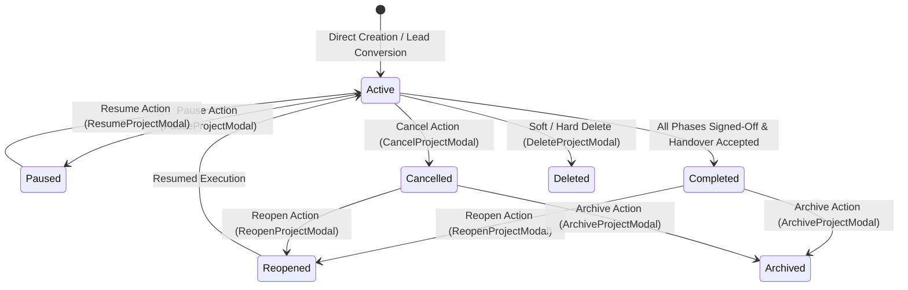

# Project Execution & Delivery Suite Documentation

This document describes the architectural layout, database models, lifecycle states, API endpoints, business logic, and the complete 36-tab execution workflow for the **Project Execution & Delivery Suite** of the CRM.

---

## 1. Module Overview & Lifecycle States

The **Project Module** orchestrates the complete end-to-end execution lifecycle of interior design, turnkey architecture, and construction projects. 

### Creation Modes
1. **Lead Conversion**: Automated creation when a qualified lead is converted via `POST /api/leads/:id/convert-to-project`. All linked estimates, client details, floor plans, and custom parameters are seamlessly migrated.
2. **Direct Project Creation**: Manual setup via `POST /api/projects`, with the option to hydrate phases and milestones from a pre-configured **Project Template**.

### Lifecycle Status State Machine
A project transitions through defined lifecycle states, controlled by explicit modal actions and audit-logged endpoints:

```mermaid
stateDiagram-v2
    [*] --> Active : Direct Creation / Lead Conversion
    Active --> Paused : Pause Action (PauseProjectModal)
    Paused --> Active : Resume Action (ResumeProjectModal)
    Active --> Completed : All Phases Signed-Off & Handover Accepted
    Active --> Cancelled : Cancel Action (CancelProjectModal)
    Completed --> Reopened : Reopen Action (ReopenProjectModal)
    Cancelled --> Reopened : Reopen Action (ReopenProjectModal)
    Reopened --> Active : Resumed Execution
    Completed --> Archived : Archive Action (ArchiveProjectModal)
    Cancelled --> Archived : Archive Action (ArchiveProjectModal)
    Active --> Deleted : Soft / Hard Delete (DeleteProjectModal)
```

* **`active`**: Project is under active design, procurement, or site construction.
* **`on_hold` / `paused`**: Execution is temporarily frozen (e.g., client payment delay, site access blocker). Requires a recorded pause reason.
* **`completed`**: All phases, milestones, snags, and property handover procedures are finalized and signed off.
* **`cancelled`**: Project terminated prior to completion. Requires mandatory cancellation rationale and financial settlement review.
* **`archived`**: Historical record preserved for auditing and warranty tracking.

---

## 2. Complete Project Workspace Structure (36 Specialized Tabs)

The project detail interface ([ProjectDetail.jsx](file:///d:/Digicloudify%20softwares/CRM-Interior-Construction/client/src/pages/projects/ProjectDetail.jsx)) is organized into **10 logical execution stages** comprising **36 specialized functional tabs**:

### Stage 1: Initiation & Setup
1. **Overview**: Project health KPIs, base vs revised target dates (accounting for approved change order timeline impacts), days remaining, client stakeholder contacts directory, staff absence/leave coverages, and project lifecycle action triggers (Pause, Resume, Cancel, Reopen, Archive, Delete).
2. **Phases & Schedule**: Interactive Gantt Chart and Phase Timeline with drag-and-drop phase reordering, milestone dependencies, and critical path tracking.
3. **Client Profile**: Primary customer profile, co-owners, decision authority levels, and communication channel preferences.
4. **Site Details**: Property dimensions, site address, access restrictions, utility connections, and geo-location.
5. **Team & Roles**: Internal resource allocations (Project Manager, Interior Designer, Site Engineer, QC Inspector) and contractor teams.
6. **Booking**: Initial booking confirmation, advance token collection, contract signing, and the `verifyProjectBooked` security gate.
7. **Baseline Assessment**: Pre-kickoff site survey, baseline photos, civil condition audits, and structural constraints.

### Stage 2: Design, Planning & Architectural Drawings
8. **Design & Approvals**: Visual progression across design stages: *Concept Brief → 2D Space Planning → 3D Photorealistic Renders → Working Construction Drawings*.
9. **Drawing Register**: Centralized architectural drawing repository. Tracks drawing types (Architectural, Structural, Electrical, Plumbing, HVAC, Joinery), revision numbers (`R0`, `R1`, `R2`), revision reasons, and attachments.
10. **Design Brief**: Comprehensive client design requirements, space utilization goals, and room-by-room briefs.
11. **Design Assets**: Moodboards, high-resolution 3D renders, CAD drawings, and design reference attachments.
12. **Design Reviews**: Internal design QA reviews, client design review feedback rounds, and digital design approvals.
13. **Material Palettes**: Curated finish specifications: Flooring, Wall Finishes, Veneers, Laminates, Hardware, Sanitaryware, and Lighting.
14. **Substitutions**: Material substitution requests, cost difference calculations, timeline impacts, and client authorization.
15. **Coordination**: Alignment matrix between Designer, Site PM, Factory, and Suppliers to avoid site clashes.

### Stage 3: Financials, Budget & Client Cash Flow
16. **Financial Overview**: Real-time project financials: Committed Contract Value, Total Billed, Cash Collected, Pending Collections, Actual Costs Incurred, and Realized Gross Margin.
17. **Budget**: Category-level budget allocations (Civil, Carpentry, Electrical, Plumbing, Finishes, Labor, Contingency).
18. **Quotations & Budget**: Bill of Quantities (BOQ) builder supporting itemized dimensions, unit rates, markups, GST tax calculations, and quotation revision versions (`draft`, `sent`, `accepted`, `revised`).
19. **Payments**: Scheduled payment milestones, automated invoice generation, payment receipts, payment aging, and overdue payment escalations.
20. **Change Orders**: Formal scope variations, extra work indents, budget impact approvals, and schedule adjustments.
21. **Budget Variance**: Baseline estimated BOQ cost vs actual site expenditure analysis.
22. **Commercial Approval**: Special commercial discounts, credit notes, and cost variation reviews.

### Stage 4: Procurement & Vendor Sourcing
23. **Purchase Requests**: Site material indents and purchase requests (PR) submitted by site engineers.
24. **Purchase Orders**: Official purchase orders (PO) issued to approved vendors with delivery deadlines.
25. **Vendors**: Project-specific vendor assignments, payment terms, and vendor performance history.
26. **Material Deliveries**: Inward Goods Receipt Notes (Site GRN), delivery inspections, shortage/damage tracking.
27. **Factory Production**: Modular millwork orders, joinery panel cutting lists, CNC programming requests, and dispatch schedules.

### Stage 5: Execution & Site Monitoring
28: **Tasks**: Comprehensive project task board with subtasks, checklists, task attachments, and dependency links (`taskDependencies`).
29. **Room Progress**: Zone-by-zone completion percentages (e.g., Living Room 85%, Master Bed 60%, Kitchen 95%).
30. **Site Visits**: Logged PM and site supervisor visits with GPS geo-fencing verification, observations, and photo evidence.
31. **Daily Site Reports (DSR)**: Daily operational logs: weather conditions, trade-wise labor headcounts, work completed, materials received, and site blockers.
32. **Weekly Reports**: Executive weekly summary reports compiled for senior management and clients.
33. **Documents**: Secure document vault organized by categories (Contracts, Permits, Drawings, Site Photos, Invoices).
34. **Meeting Notes**: Minutes of Meeting (MOM) recording attendees, discussions, decisions, and assigned action items with deadlines.
35. **Delay Notifications**: Formal delay advisories sent to clients or subcontractors with root-cause categorization.
36. **MEP Checklist**: Mechanical, Electrical, and Plumbing pre-commissioning verification checklists.

### Stage 6: Quality Control, Snags & Readiness (Pre-Handover)
* **Snags**: Comprehensive snag/punch-list defect logging with room tag, severity (`critical`, `major`, `minor`), before/after photo proofs, contractor assignment, and rectification verification.
* **Handover Readiness**: Multi-point gate audit ensuring all snags are cleared, MEP tests pass, and deep cleaning is completed before inviting the client for possession.
* **Handovers**: Inspection logs and preliminary handover sessions.

### Stage 7: Property Handover (Completion)
* **Handover**: Official property handover protocol, handover kit sign-off (keys, appliance manuals, warranty cards), and client satisfaction sign-off.

### Stage 8: Project Closure & Retrospective
* **Project Closure**: Final commercial reconciliation, retention money release schedule, and formal project closure certificate.
* **Retrospective**: Post-project debrief analyzing budget variances, scheduling accuracy, vendor performance scores, and internal team learnings.

### Stage 9: Post-Handover & Maintenance
* **Warranties**: Digital warranty certificates issued for structural woodwork, modular hardware, electrical fixtures, and civil waterproofing.
* **AMCs**: Annual Maintenance Contracts, scheduled maintenance visit calendar, and renewal tracking.
* **Service Tickets**: Post-handover customer defect reports with SLA resolution timers and technician dispatch.
* **Customer Retention**: Client follow-up milestones, referral tracking, and loyalty incentives.

### Stage 10: Audit & Governance
* **Activity Logs**: Immutable audit log of every creation, edit, status transition, document upload, and sign-off across the project.

---

## 3. Sub-Router API Architecture

All project sub-resources are mounted hierarchically under `/api/projects/:projectId/...`:

| Sub-Route | Implementation File | Primary Responsibilities |
| :--- | :--- | :--- |
| `/phases` | [phases.js](file:///d:/Digicloudify%20softwares/CRM-Interior-Construction/server/src/routes/phases.js) | Phase CRUD, drag-and-drop order updates, and phase completion sign-off cascade |
| `/tasks` | [tasks.js](file:///d:/Digicloudify%20softwares/CRM-Interior-Construction/server/src/routes/tasks.js) | Project tasks, milestone grouping, checklists, and attachments |
| `/documents` | [documents.js](file:///d:/Digicloudify%20softwares/CRM-Interior-Construction/server/src/routes/documents.js) | S3 presigned document upload URLs, file metadata, categories |
| `/design-assets` | [designAssets.js](file:///d:/Digicloudify%20softwares/CRM-Interior-Construction/server/src/routes/designAssets.js) | 2D/3D design assets, rendering uploads, moodboards |
| `/design-reviews` | [designReviews.js](file:///d:/Digicloudify%20softwares/CRM-Interior-Construction/server/src/routes/designReviews.js) | Client design review rounds, feedback, sign-offs |
| `/material-palettes`| [materialPalettes.js](file:///d:/Digicloudify%20softwares/CRM-Interior-Construction/server/src/routes/materialPalettes.js) | Finish palettes, tile/laminate selection, approvals |
| `/change-orders` | [changeOrders.js](file:///d:/Digicloudify%20softwares/CRM-Interior-Construction/server/src/routes/changeOrders.js) | Scope variations, cost delta, timeline revisions |
| `/quotations` | [quotations.js](file:///d:/Digicloudify%20softwares/CRM-Interior-Construction/server/src/routes/quotations.js) | BOQ lines, dimensions, markup calculations, quotes |
| `/budget` | [budget.js](file:///d:/Digicloudify%20softwares/CRM-Interior-Construction/server/src/routes/budget.js) | Budget categories, line item allocations, spending |
| `/purchase-orders` | [purchaseOrders.js](file:///d:/Digicloudify%20softwares/CRM-Interior-Construction/server/src/routes/purchaseOrders.js) | Vendor purchase orders, delivery status, costs |
| `/purchase-requests`| [purchaseRequests.js](file:///d:/Digicloudify%20softwares/CRM-Interior-Construction/server/src/routes/purchaseRequests.js) | Site material indents and approval workflows |
| `/material-deliveries`| [materialDeliveries.js](file:///d:/Digicloudify%20softwares/CRM-Interior-Construction/server/src/routes/materialDeliveries.js) | Site GRN, physical receipts, inspection checks |
| `/production-orders`| [productionOrders.js](file:///d:/Digicloudify%20softwares/CRM-Interior-Construction/server/src/routes/productionOrders.js) | Factory modular joinery orders, CNC cutting lists |
| `/work-activities` | [workActivities.js](file:///d:/Digicloudify%20softwares/CRM-Interior-Construction/server/src/routes/workActivities.js) | Site execution trade activities, dependencies |
| `/daily-reports` | [dailySiteReports.js](file:///d:/Digicloudify%20softwares/CRM-Interior-Construction/server/src/routes/dailySiteReports.js) | DSR logs: labor count, work done, weather |
| `/room-progress` | [roomProgress.js](file:///d:/Digicloudify%20softwares/CRM-Interior-Construction/server/src/routes/roomProgress.js) | Zone-wise and room-wise completion percentages |
| `/meeting-notes` | [meetingNotes.js](file:///d:/Digicloudify%20softwares/CRM-Interior-Construction/server/src/routes/meetingNotes.js) | MOM logs, attendee registers, action items |
| `/delay-notifications`| [delayNotifications.js](file:///d:/Digicloudify%20softwares/CRM-Interior-Construction/server/src/routes/delayNotifications.js)| Delay notices, impact days, root-cause taxonomy |
| `/drawing-register` | [drawingRegister.js](file:///d:/Digicloudify%20softwares/CRM-Interior-Construction/server/src/routes/drawingRegister.js) | Drawing sheet revisions, CAD/PDF attachments |
| `/punch-lists` | [punchLists.js](file:///d:/Digicloudify%20softwares/CRM-Interior-Construction/server/src/routes/punchLists.js) | Snag list items, photo proofs, rectifications |
| `/warranties` | [warranties.js](file:///d:/Digicloudify%20softwares/CRM-Interior-Construction/server/src/routes/warranties.js) | Product & workmanship warranty certificates |
| `/amcs` | [amcs.js](file:///d:/Digicloudify%20softwares/CRM-Interior-Construction/server/src/routes/amcs.js) | Maintenance contracts, inspection schedules |
| `/service-tickets` | [serviceTickets.js](file:///d:/Digicloudify%20softwares/CRM-Interior-Construction/server/src/routes/serviceTickets.js) | Post-handover customer issues, SLA tracking |
| `/closure-checklist`| [projectClosures.js](file:///d:/Digicloudify%20softwares/CRM-Interior-Construction/server/src/routes/projectClosures.js)| Final commercial settlement, handoff sign-off |
| `/retrospective` | [projectRetrospectives.js](file:///d:/Digicloudify%20softwares/CRM-Interior-Construction/server/src/routes/projectRetrospectives.js)| Post-mortem findings, vendor ratings |
| `/attendance` | [labourAttendance.js](file:///d:/Digicloudify%20softwares/CRM-Interior-Construction/server/src/routes/labourAttendance.js)| Daily trade labor attendance headcounts |
| `/payment-escalations`| [paymentEscalations.js](file:///d:/Digicloudify%20softwares/CRM-Interior-Construction/server/src/routes/paymentEscalations.js)| Overdue milestone payment escalation rules |

---

## 4. Key Business Logic & Cascade Rules

### Phase Completion Cascade
When a project phase is signed off via `POST /api/projects/:projectId/phases/:phaseId/sign-off`:
1. Validates that all milestones linked to the phase are in the `'completed'` status.
2. Marks the current phase `status = 'completed'`, logs the signing user and timestamp.
3. Automatically advances the next phase (by `sort_order + 1`) to `status = 'in_progress'`.
4. If no subsequent phases exist, updates the parent project `status = 'completed'` and initiates the pre-handover readiness review.

### Milestone Payment Trigger
When an execution milestone is marked completed via `POST /api/phases/:phaseId/milestones/:mid/complete`:
* If `triggers_payment` is `true`, the system automatically locates the linked record in `payment_milestones` and shifts its status from `'scheduled'` to `'invoice_raised'`, alerting the finance team to generate the client tax invoice.

### Change Order Budget & Schedule Adjustment
When a variation request is approved:
* Adjusts `projects.contract_value` by adding the approved change order amount.
* Recalculates `projects.target_date` by adding approved `timeline_impact_days`.
